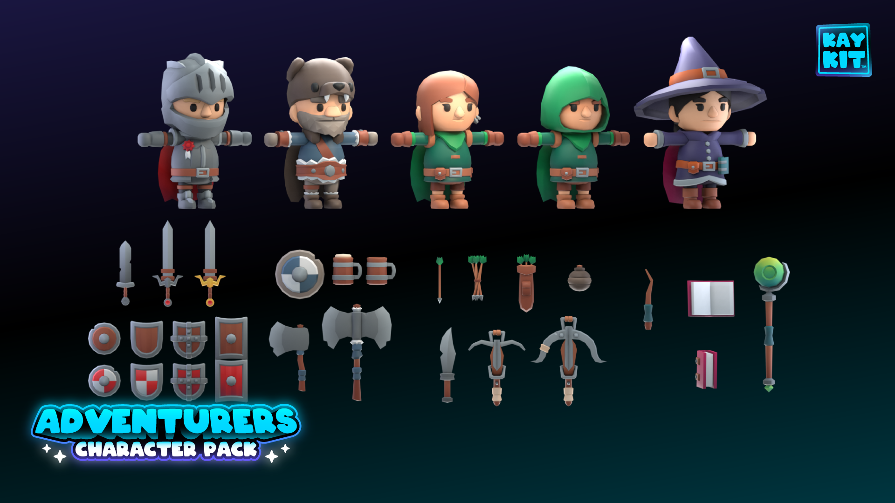
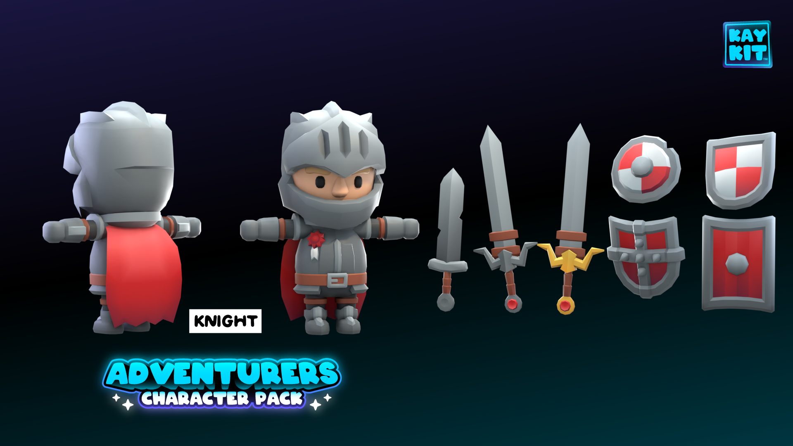
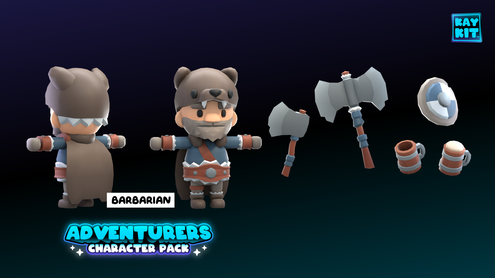
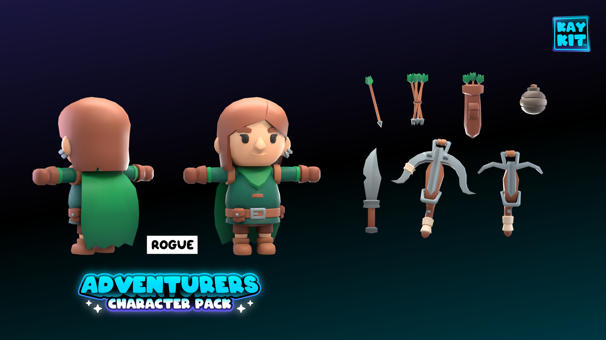
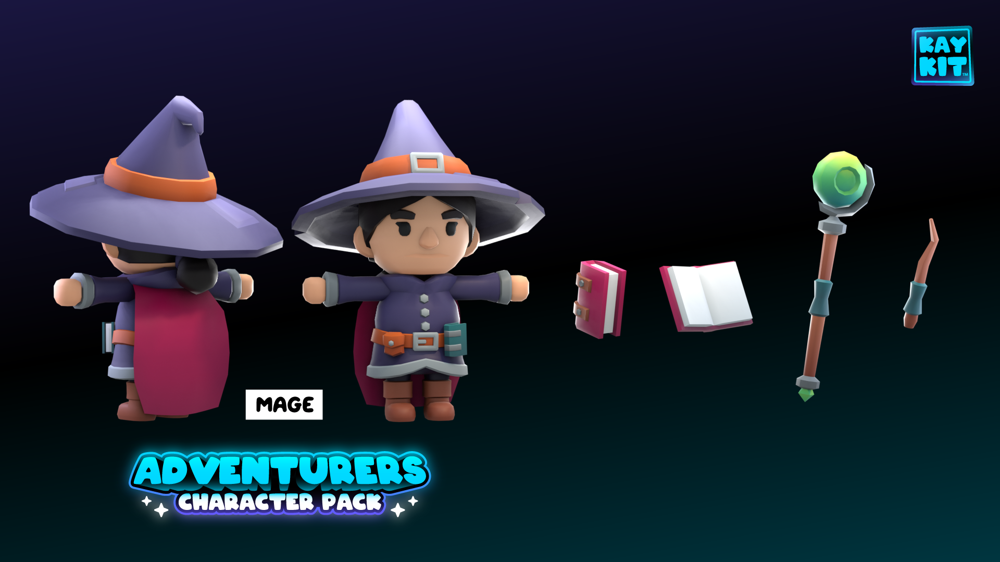

# Godot AnimationTree Test

An AnimationTree test for Godot 4.1 using the free version of [KayKit - Character Pack : Adventurers](https://kaylousberg.itch.io/kaykit-adventurers)

3D animations is something I've been struggling with for a while.

Blending walk/run animations with attack animations, for example, is something I know the theory of but have never been able to implement in Godot until now.

I've been using the [Godot AnimationTree tutorial](https://docs.godotengine.org/en/stable/tutorials/animation/animation_tree.html) as a guide.

Checklist:

* All Characters
  * [x] Idle/Walk/Run animation
  * [x] Jump/fall animation
  * [x] Dash animation
  * [ ] Unarmed attack animations (idle, punch, kick)
  * [ ] Pick up animation
  * [ ] Use item animation
  * [ ] Interact animation
  * [ ] Cheer animation
  * [ ] Hit animation
  * [ ] Death animation
  * [ ] Lie down animation
  * [ ] Sit in chair animation
  * [ ] Sit on ground animation

* Knight
  * [x] One handed sword attack animation
  * [x] Jump attack animation
  * [x] Dash spinning attack animation
  * [x] Block (with shield) animation
  * [x] Bash (with shield) animation
  * [ ] Block hit animation
  * [ ] Dodge (while blocking) animation
  * [ ] Two handed sword attack animation

* Barbarian
  * [x] Dual wield axe attack animation
  * [x] Jump attack animation
  * [x] Dash spinning attack animation
  * [x] Block (with shield) animation
  * [x] Bash (with shield) animation
  * [ ] Block hit animation
  * [ ] Dodge (while blocking) animation
  * [ ] Single wield axe attack animation
  * [ ] Two handed axe attack animation
  * [ ] Hold/drink beer animation

* Rogue
  * [x] One handed Aim/Shoot animation
  * [x] Reload animation
  * [ ] Sneak/Stab animation
  * [ ] Throw bomb animation
  * [ ] Two handed Aim/Shoot animation

* Mage
  * [ ] Cast spell animation
  
